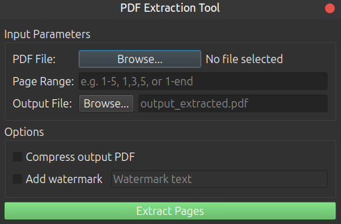

# PDF Extractor Tool

A Qt-based GUI application for extracting specific pages from PDF documents.

 *(optional: add actual screenshot later)*

## Features

- Select input PDF files via file dialog
- Specify page ranges in multiple formats:
  - Single pages: `1,3,5`
  - Page ranges: `1-10` or `5-end`
  - Combinations: `1,3,5-10`
- Set output file name and location
- Built-in input validation
- Cross-platform support (Windows, Linux, macOS)

## Requirements

- Qt 6 (or Qt 5)
- C++17 compatible compiler
- On Linux: `pdftk` (for PDF manipulation)

## Installation

### Linux

1. Install dependencies:
   ```bash
   sudo apt update
   sudo apt install build-essential qt6-base-dev pdftk
